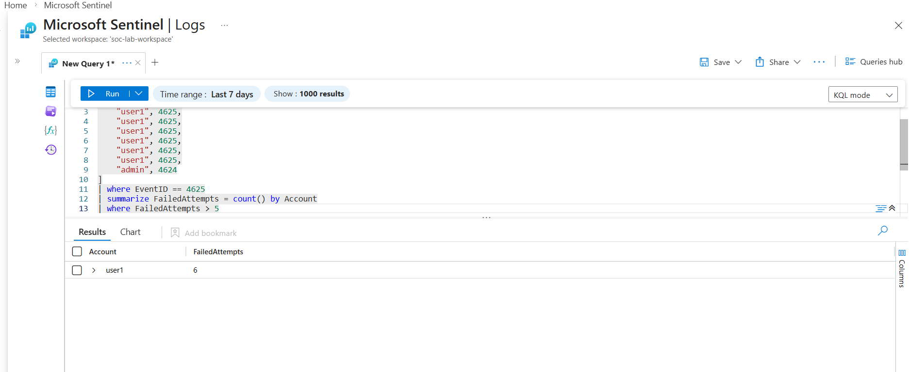

# Azure Sentinel SOC Lab – Brute Force Detection

## Project Overview
This project simulates a Security Operations Center (SOC) use case using Microsoft Sentinel.  
The goal is to detect brute-force login attempts using KQL (Kusto Query Language).

---

## Tools Used
- Microsoft Sentinel
- Azure Log Analytics Workspace
- KQL (Kusto Query Language)

---

## Detection Use Case: Brute Force Attack

### Objective
Identify accounts with more than 5 failed login attempts within a 5-minute window.

### KQL Query
```kql
SecurityEvent
| where EventID == 4625
| summarize FailedAttempts = count() by Account, bin(TimeGenerated, 5m)
| where FailedAttempts > 5
```

---

## Detection Logic Explanation
- EventID 4625 represents failed login attempts.
- The query counts failed logins per account.
- If an account exceeds 5 failures within 5 minutes, it may indicate a brute-force attack.

---
## Detection Output



## Analytics Rule Configuration


## Skills Demonstrated
- SIEM monitoring
- Threat detection logic
- KQL query writing
- Security analysis mindset
